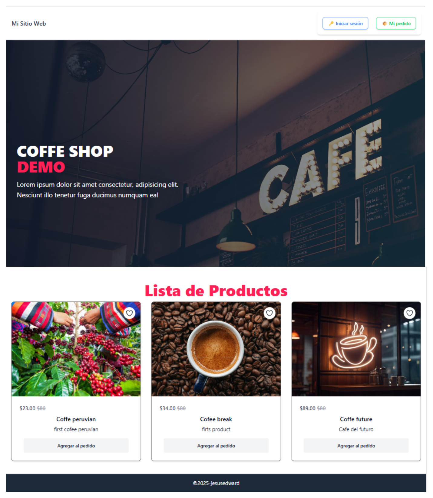

Coffee Shop
------------

Welcome to the Coffee Shop project! This Django application is designed to manage a coffee shop's products, orders, and users efficiently.

  <!-- Aquí se muestra la imagen -->

Requirements
------------

*   **PostgreSQL** (Make sure it's installed and running)
*   **Python 3.11**

Project Structure
------------
*   **products**: Handles everything related to coffee products.
*   **users**: Manages user authentication and profiles.
*   **orders**: Manages customer orders.

Contributions
------------

We welcome contributions! Please fork the repository and submit pull requests for any features, improvements, or bug fixes.